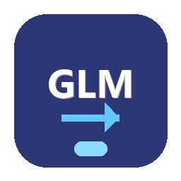

<p align="center">
  
</p>

<h1 align="center">GLM - Game Library Manager</h1>

<p align="center">
  A universal game library transfer tool for Windows that lets you move installed games between drives while keeping your launchers happy.
</p>

<p align="center">
  
  
  
  
</p>

---

## What is GLM?

Running out of space on your C: drive? Want to move your games to a faster SSD? **GLM** handles the entire process — moving game files, updating launcher configurations, and cleaning up old paths — so your games just work at their new location.

No more manually editing config files, registry entries, or re-downloading 100GB+ games.

## Supported Launchers

| Launcher | Detection | Path Update | Notes |
|----------|-----------|-------------|-------|
| **Steam** | `libraryfolders.vdf` + app manifests | Direct VDF edit | Full library management support |
| **Epic Games** | Manifest files in `ProgramData` | Direct manifest edit | Reads `.item` manifest files |
| **GOG Galaxy** | Windows Registry | Registry update | `HKLM\SOFTWARE\GOG.com` |
| **Battle.net** | `aggregate.json` | Manual (Locate Game) | Modern detection via Agent config |
| **EA App** | Windows Registry | Registry update | Detects via `HKLM\SOFTWARE\EA Games` |
| **Ubisoft Connect** | Windows Registry | Registry update | Uninstall registry integration |

## Features

### Game Transfer
- **Cross-drive transfers** with file-by-file copying and integrity verification
- **Same-drive moves** using instant `Directory.Move` (no data copying needed)
- **Pause / Resume** — pause a transfer and pick it back up later
- **Cancel with cleanup** — cancelling removes partial files at the destination
- **Automatic rollback** on failure — your game stays safe at the original location
- **Batch transfers** — queue up multiple games and transfer them all at once
- **Real-time progress** — see bytes copied, files copied, current file, and transfer phase

### Library Import
- **Auto-detect unmanaged games** across all drives and launchers
- **Import games into organized library folders** (`GLM Library` per drive)
- **Size estimation** and transfer time calculation
- **Launcher-specific color coding** for easy identification

### Library Management
- **Clean empty Steam libraries** — remove empty library folders from all drives
- **Drive space analysis** — see available space across all drives
- **Junction resolution** — correctly identifies already-managed games

### Transfer Phases
Each transfer goes through a structured pipeline:

1. **Preflight** — Validates paths, checks disk space, ensures launcher isn't running
2. **Copying** — Transfers files (or instant move for same-drive)
3. **Verification** — Compares file counts and structure (cross-drive only)
4. **Updating References** — Updates launcher configs, registry entries, and shortcuts
5. **Cleanup** — Removes original files and empty library folders

## Screenshots

*Coming soon*

## Installation

### Portable (Recommended)

1. Download `GLM-portable.zip` from [Releases](https://github.com/Featy26/GLM-Game-Library-Manager/releases)
2. Extract anywhere
3. Run `GLM.exe`

That's it. No installer, no .NET runtime required — everything is bundled.

### Build from Source

**Prerequisites:**
- [.NET 9.0 SDK](https://dotnet.microsoft.com/download/dotnet/9.0)
- Windows 10/11 x64

```bash
git clone https://github.com/Featy26/GLM-Game-Library-Manager.git
cd GLM-Game-Library-Manager

# Run in development mode
dotnet run --project src/GameTransfer.App

# Build portable release
dotnet publish src/GameTransfer.App/GameTransfer.App.csproj -c Release -r win-x64 --self-contained true -p:PublishSingleFile=true -p:IncludeNativeLibrariesForSelfExtract=true -o ./publish
```

## Project Structure

```
src/
├── GameTransfer.App/           # WPF UI Application
│   ├── ViewModels/             # MVVM ViewModels (Main, Transfer, Import, etc.)
│   ├── Views/                  # XAML UI
│   ├── Converters/             # XAML value converters
│   └── Helpers/                # Admin elevation, icon loading
│
├── GameTransfer.Core/          # Business Logic
│   ├── Services/
│   │   ├── TransferOrchestrator.cs   # Main transfer engine
│   │   ├── FileTransferService.cs    # File copy with pause/resume
│   │   ├── DriveAnalyzer.cs          # Drive space analysis
│   │   ├── RegistryService.cs        # Windows Registry operations
│   │   └── ShortcutService.cs        # .lnk shortcut updates
│   ├── Models/                 # GameInfo, TransferJob, TransferProgress
│   ├── Interfaces/             # Plugin & service contracts
│   └── Helpers/                # VDF parser, path utils, file hashing
│
└── GameTransfer.Plugins/       # Launcher Plugins
    ├── Base/                   # LauncherPluginBase
    ├── Steam/
    ├── EpicGames/
    ├── GOG/
    ├── BattleNet/
    ├── EA/
    └── Ubisoft/
```

## Tech Stack

| Component | Technology |
|-----------|-----------|
| Framework | .NET 9.0 (Windows) |
| UI | WPF with [WPF-UI 4.2](https://github.com/lepoco/wpfui) (Fluent Design) |
| Architecture | MVVM ([CommunityToolkit.Mvvm](https://github.com/CommunityToolkit/dotnet)) |
| DI | Microsoft.Extensions.DependencyInjection |
| Logging | [Serilog](https://serilog.net/) (file sink, daily rotation) |
| Database | SQLite (via Microsoft.Data.Sqlite) for launcher data |
| Hashing | System.IO.Hashing for file verification |

## How It Works

### Plugin Architecture

Each launcher is implemented as a plugin inheriting from `LauncherPluginBase`:

```
ILauncherPlugin
├── DetectInstalledGamesAsync()    // Find games from launcher config
├── UpdateGamePathAsync()          // Update launcher to new path
├── UninstallGameAsync()           // Remove game + launcher metadata
├── IsLauncherRunning()            // Block transfers while launcher is open
└── PostImportCleanupAsync()       // Clean up after import
```

Plugins that support `SupportsDirectReconfiguration` (Steam, Epic, GOG) can update their configs programmatically. Others (Battle.net, EA, Ubisoft) may require manual "Locate Game" in the launcher after transfer.

### Same-Drive vs. Cross-Drive

- **Same drive** (e.g., `D:\Games` to `D:\GLM Library`): Uses `Directory.Move()` — instant, no data copying
- **Cross drive** (e.g., `C:\Games` to `D:\GLM Library`): Full file copy with verification, then deletes original

### Safety Features

- Registry values are backed up before modification and restored on failure
- Cross-drive transfers verify file counts after copying
- Failed transfers roll back all changes (files + registry)
- Launcher running detection prevents config corruption

## Admin Privileges

GLM requests admin elevation when needed for:
- Windows Registry modifications (GOG, Ubisoft, EA launcher paths)
- Accessing protected launcher config directories
- Updating Windows shortcuts

The app runs as a normal user by default and only elevates when performing operations that require it.

## Logs

Log files are written to:
```
%APPDATA%\GLM\logs\log-YYYYMMDD.txt
```

## Contributing

Contributions are welcome! Areas that could use help:

- Additional launcher plugins (e.g., itch.io, Amazon Games)
- Localization (currently German UI)
- Unit tests
- Linux support via Avalonia (future)

## License

MIT License - see [LICENSE](LICENSE) for details.

---

<p align="center">
  Built with the help of <a href="https://claude.ai">Claude</a>
</p>
